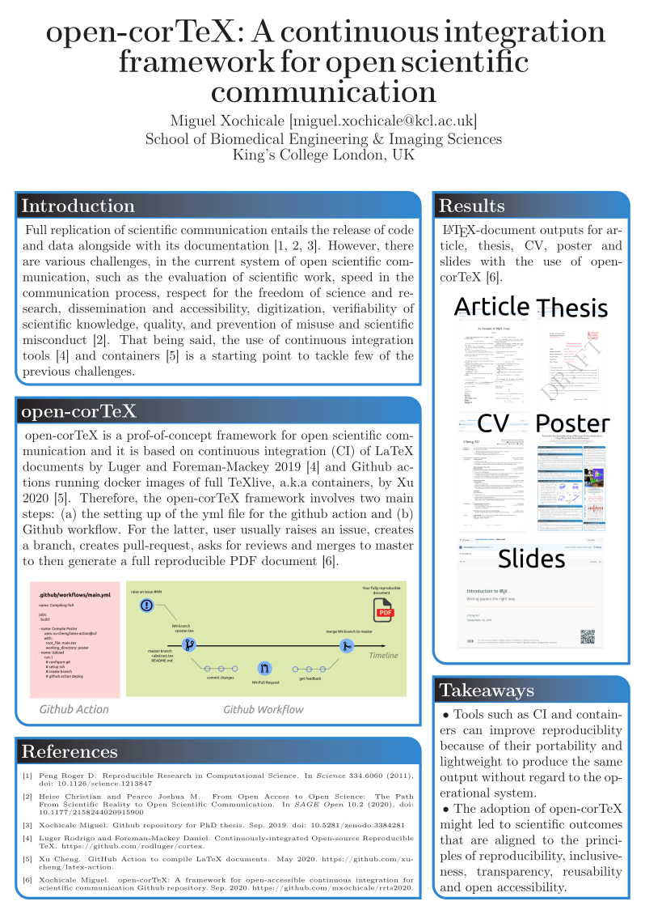

# open-corTeX: A continuous integration framework for open scientific communication
  

## Abstract
Nearly a decade ago, December 2011, Roger Peng published an spectrum of reproducibility 
which depicts a roadmap of a scientific outcome
that went from publication only to full replication that includes code, data and software.
Such spectrum was a cornerstone for 
the publication of the first open-accessible 
and 100\% reproducible engineering-based PhD thesis in August 2019 
at the University of Birmingham established in 1900.
Even thought of such achievement, there are still many challenges in the existing system 
of formal scientific communication.
Such challenges were recently described by Heise and Pearce 2020
for aspects of evaluation of scientific work, 
speed in the communication process,
respect for the freedom of science and research,
dissemination and accessibility, digitization,
verifiability of scientific knowledge, quality, 
and prevention of misuse and scientific misconduct.
Alongside with the state-of-the-art of research software engineering
in the context of open access science that is starting to make use 
of continuous integration tools (Luger and Foreman-Mackey 2019) and containers (Xu 2020).
That being said, in this talk I will introduce a proof-of-concept of 
"open-corTeX: A framework for Continuously-integrated Open-source Reproducible TeX" 
as an updated version of the spectrum of reproducibility for 
formal scientific communication.
Using open-corTeX, I will present an example of the usage of framework 
for the case of an open-access thesis 
as well as other academic documents such as cv, slides, and reports. 
Similarly, I will show how the state-of-the-art of open-access in scientific 
communication is adopting continuous integration (CI/CD) tools
as well as the use of containers.
To then conclude the talk by emphasising 
the adoption of open-corTeX might led to scientific outcomes 
that are aligned the principles of 
reproducibility, inclusiveness, transparency,
reusability  and open accessibility.

## Poster and video 
Click on the poster to watch a 2 minutes presentation  

## Extras
* Setting up of :octocat: action for abstract: https://github.com/mxochicale/rrts2020/tree/master/abstract
* Setting up of :octocat: action for poster: https://github.com/mxochicale/rrts2020/tree/master/poster
* PDFS: https://github.com/mxochicale/rrts2020/tree/pdf
* :octocat: repository: https://github.com/mxochicale/rrts2020

# Reproducibility, Replicability and Trust in Science (Virtual Conference)
## Details
This new meeting will bring together an international audience of researchers motivated to improve the robustness of scientific research. It will also involve important stakeholder groups: data and services providers, publishers, institutions and funders that are developing policies and tools. The conference will start at 12.30 on 9 September and finish at ~2pm on 11 September 2020.
[program](/docs/program/program.pdf), [README](docs/README.md) and much more in the [website](https://coursesandconferences.wellcomegenomecampus.org/our-events/reproducibility-replicability-trust-in-science-2020/).

